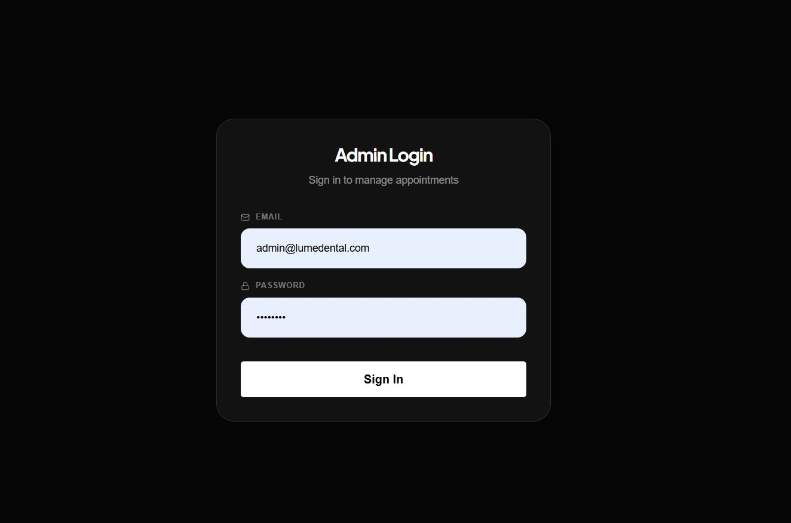

# Lume Dental 🦷

Lume Dental is a premium, full-stack web application built for modern dental clinics. It features a stunning, dynamic frontend for patients and a secure, data-rich backend for clinic administrators to manage appointments.

## 📸 Screenshots

Here are some screenshots of the live application. (Place your screenshot files in the `screenshots/` directory).


*Modern Landing Page*


*Booking an Appointment*


*Admin Dashboard with Analytics*

*Login Page*


## 🚀 Features

### For Patients
- **Beautiful Landing Page**: Built with React and styled with a custom dark-theme using TailwindCSS. Micro-animations powered by Motion.
- **Guest Appointment Booking**: Patients can easily request appointments without needing to create an account.
- **Responsive Design**: Flawlessly optimized for mobile, tablet, and desktop viewing.
- **Client-side Validation**: Instant error checking using `react-hook-form` and `zod` before any data is sent to the server.

### For Administrators
- **Secure Authentication**: JWT-based login system for clinic staff, using hashed passwords (`bcrypt`).
- **Admin Dashboard**: A comprehensive overview built with Recharts.
  - **Appointments Over Time**: Line chart tracking daily bookings.
  - **Services Popularity**: Bar chart showing which services are requested the most.
  - **Status Breakdown**: Pie chart visualizing pending, confirmed, and cancelled requests.
- **Appointment Management**: Quickly confirm or cancel incoming patient requests with a single click.

## 🛠️ Technology Stack
- **Frontend**: Vite, React 19, TailwindCSS 4, React Router, Recharts, Lucide Icons, Motion (Framer Motion).
- **Backend**: Node.js, Express.js, JWT, Bcrypt.
- **Database**: SQLite (via a custom lightweight wrapper mimicking MySQL's interface for effortless migration).

## ⚙️ Getting Started

### Prerequisites
Make sure you have Node.js installed on your machine.

### 1. Install Dependencies
You need to install dependencies for both the frontend and the backend.
```bash
# Install frontend dependencies
npm install

# Install backend dependencies
cd backend
npm install
```

### 2. Start the Application
You will need to run two terminal windows to start both servers simultaneously.

**Terminal 1 (Backend Server):**
```bash
cd backend
npm run dev
```
*(The SQLite database is automatically generated and seeded on startup!)*

**Terminal 2 (Frontend Server):**
```bash
# In the root project directory
npm run dev
```
---
##  Project Information
- **Developer:** [Suber Sulub](https://github.com/zupeirr)
- **Project Name:** Local Business Website
- **Program:** Future Intern
- **Task:** Final Task – Dental
- **CIN ID:** FIT/APR26/FS14947