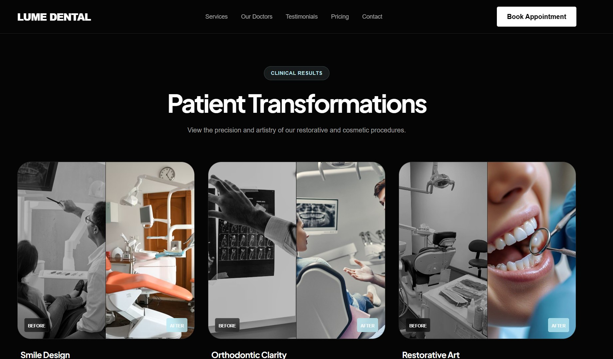
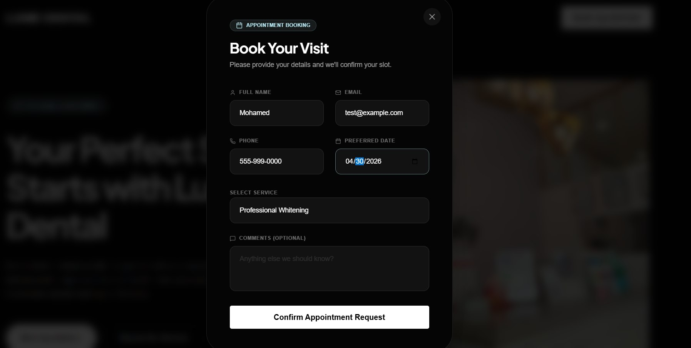
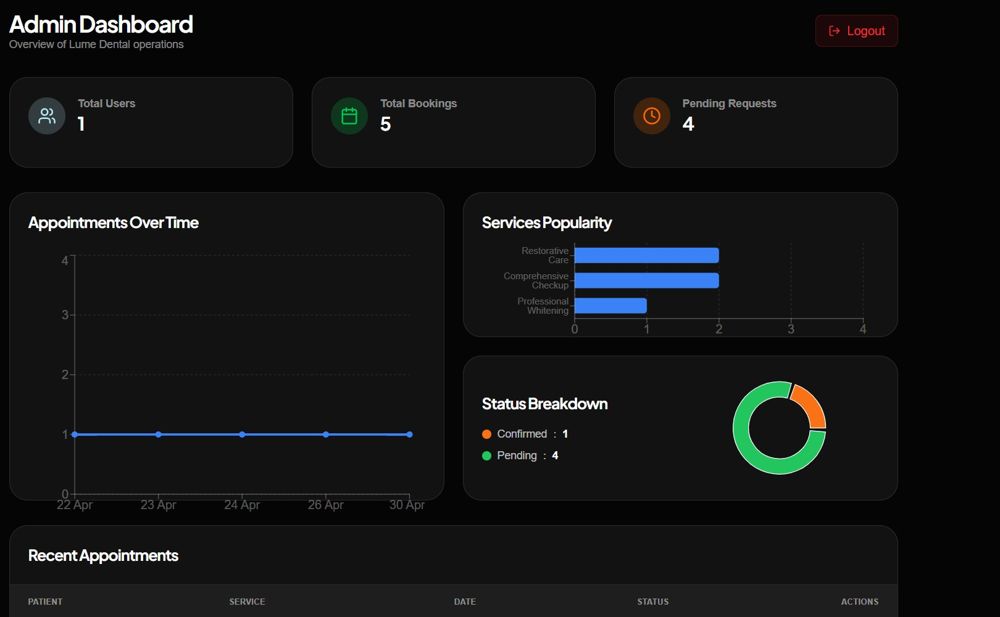

# Lume Dental 🦷

Lume Dental is a premium, full-stack web application built for modern dental clinics. It features a stunning, dynamic frontend for patients and a secure, data-rich backend for clinic administrators to manage appointments.

## 📸 Gallery

Here is a quick look at the core interfaces of the platform:

**1. Landing Page Overview**  
  
*The modern, dark-themed hero section welcoming patients to the clinic.*

**2. Seamless Booking Modal**  
  
*A clean, intuitive form allowing patients to request an appointment instantly.*

**3. Secure Admin Login**  
  
*The secure gateway for administrators to access the backend dashboard.*

**4. Real-time Admin Dashboard**  
  
*The comprehensive dashboard featuring dynamic Recharts for appointments and services, alongside a quick-action list to manage recent bookings.*

## 🚀 Features

### For Patients
- **Beautiful Landing Page**: Built with React and styled with a custom dark-theme using TailwindCSS. Micro-animations powered by Motion.
- **Guest Appointment Booking**: Patients can easily request appointments without needing to create an account.
- **Responsive Design**: Flawlessly optimized for mobile, tablet, and desktop viewing.
- **Client-side Validation**: Instant error checking using `react-hook-form` and `zod` before any data is sent to the server.

### For Administrators
- **Secure Authentication**: JWT-based login system for clinic staff, using hashed passwords (`bcrypt`).
- **Admin Dashboard**: A comprehensive overview built with Recharts.
  - **Appointments Over Time**: Line chart tracking daily bookings.
  - **Services Popularity**: Bar chart showing which services are requested the most.
  - **Status Breakdown**: Pie chart visualizing pending, confirmed, and cancelled requests.
- **Appointment Management**: Quickly confirm or cancel incoming patient requests with a single click.

## 🛠️ Technology Stack
- **Frontend**: Vite, React 19, TailwindCSS 4, React Router, Recharts, Lucide Icons, Motion (Framer Motion).
- **Backend**: Node.js, Express.js, JWT, Bcrypt.
- **Database**: SQLite (via a custom lightweight wrapper mimicking MySQL's interface for effortless migration).

## ⚙️ Getting Started

### Prerequisites
Make sure you have Node.js installed on your machine.

### 1. Install Dependencies
You need to install dependencies for both the frontend and the backend.
```bash
# Install frontend dependencies
npm install

# Install backend dependencies
cd backend
npm install
```

### 2. Start the Application
You will need to run two terminal windows to start both servers simultaneously.

**Terminal 1 (Backend Server):**
```bash
cd backend
npm run dev
```
*(The SQLite database is automatically generated and seeded on startup!)*

**Terminal 2 (Frontend Server):**
```bash
# In the root project directory
npm run dev
```

### 3. Usage
- **Public Website**: Open `http://localhost:3000` to view the landing page and test the booking form.
- **Admin Login**: Navigate to `http://localhost:3000/admin/login`
  - **Email**: `admin@lumedental.com`
  - **Password**: `admin123`

## 📂 Project Structure
- `/src`: Frontend React code (Components, Pages, App routing).
- `/backend`: Node.js/Express server.
  - `/config`: Database configuration and SQLite initialization.
  - `/controllers`: Logic for authentication, appointments, and dashboard stats.
  - `/routes`: Express routers defining API endpoints.
  - `/middleware`: JWT security and role verification.

## 🔒 Production Considerations
Before deploying to a live server:
1. Update `backend/.env` with a strong, random `JWT_SECRET`.
2. Configure `cors()` in `backend/server.js` to only accept requests from your production frontend domain.
3. Replace the SQLite database wrapper with `mysql2` if you are expecting high concurrent traffic.
